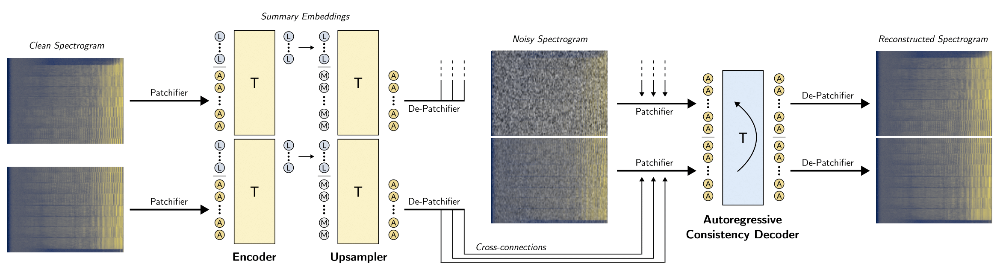
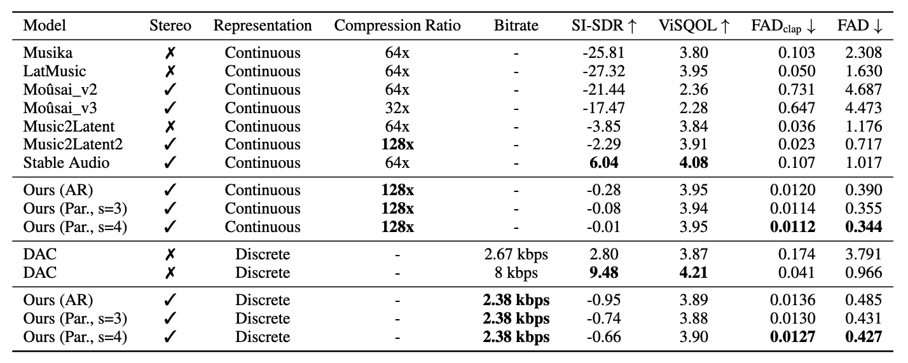
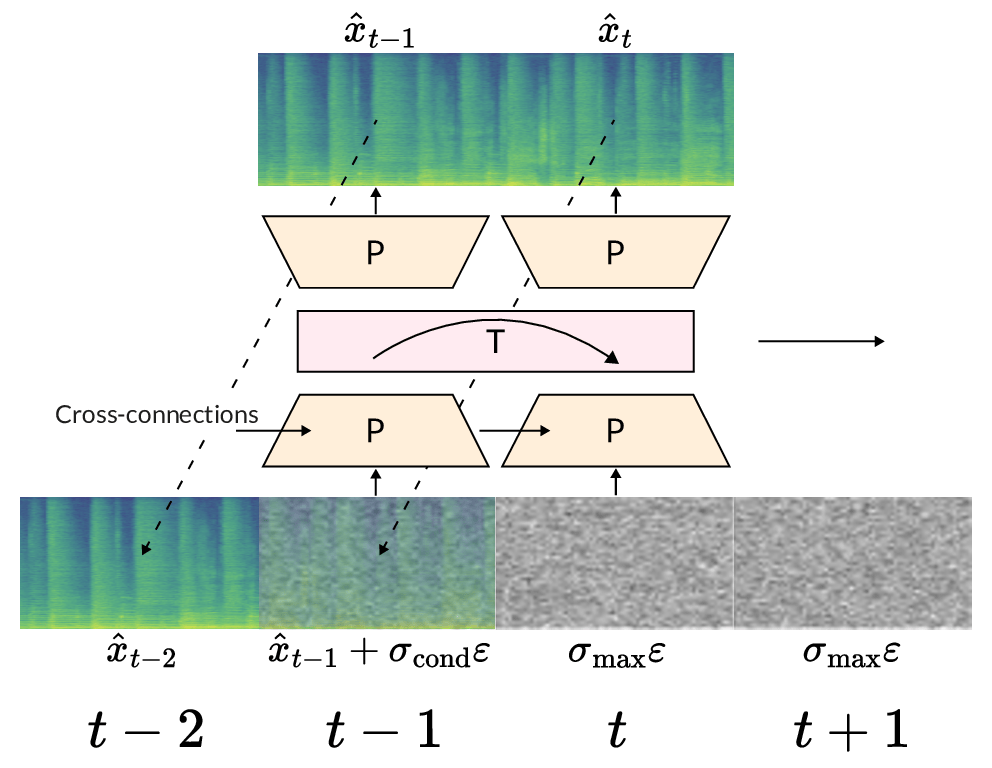

# Unifying Continuous and Discrete Compressed Representations of Audio

**Abstract**  
Efficiently representing audio signals in a compressed latent space is critical for latent generative modelling. However, existing autoencoders often force a choice between continuous embeddings and discrete tokens. Furthermore, achieving high compression ratios while maintaining audio fidelity remains a challenge. This paper introduces a novel audio autoencoder that overcomes these limitations by both efficiently encoding global features via summary embeddings, and by producing both compressed continuous embeddings at ~11 Hz and discrete tokens at a rate of 2.38 kbps from the same trained model, offering unprecedented flexibility for different downstream generative tasks. This is achieved through Finite Scalar Quantization (FSQ) and a novel FSQ-dropout technique, and does not require additional loss terms beyond the single consistency loss used for end-to-end training. Our model supports both autoregressive decoding and a novel parallel decoding strategy, with the latter achieving superior audio quality and faster decoding. Our model outperforms existing continuous and discrete autoencoders at similar bitrates in terms of reconstruction audio quality. Our work enables a unified approach to audio compression, bridging the gap between continuous and discrete generative modelling paradigms.

**Model Weights**
We plan to release the model weights of our autoencoder after the review process.  

## Architecture
Training process of our autoencoder. Transformer modules are represented with T, audio embeddings with A, learned/summary embeddings with L, and mask embeddings with M. We represent chunked causal masking with a curved arrow.

## Comparison Table
In the following table we present the evaluation results on pairwise (SI-SDR, ViSQOL) and distance-based (FAD-clap, FAD) metrics.

<!-- ## Inference/Decoding
 -->

## Audio Examples
We compare the reconstructions of our model against baselines for MusicCaps evaluation samples. 
We provide reconstructions of continuous embeddings and of discrete tokens at 2.38 kbps, using parallel decoding with 4 steps.

Stereo reconstructions are provided for stereo-capable models: Mousai, Music2Latent2, Stable Audio, and Ours.

<table style="margin-left: -5cm !important; width: 150%; border-collapse: collapse; border: 2px solid black; text-align: center;">
  <!-- Sample 1 -->
  <tr>
    <th style="width: 16.6%;">Original</th> 
    <th style="width: 16.6%;">Ours</th>
    <th style="width: 16.6%;">Ours 2.38 kbps</th>
    <th style="width: 16.6%;">Musika</th>
    <th style="width: 16.6%;">LatMusic</th>
    <th style="width: 16.6%;">Mousaiv2</th> 
  </tr>
  <tr>
    <td><audio src="real/-0SdAVK79lg.mp3" controls></audio></td>
    <td><audio src="ours/-0SdAVK79lg.mp3" controls></audio></td>
    <td><audio src="ours_2_38kbps/-0SdAVK79lg.mp3" controls></audio></td>
    <td><audio src="musika/-0SdAVK79lg.mp3" controls></audio></td>
    <td><audio src="latmusic/-0SdAVK79lg.mp3" controls></audio></td>
    <td><audio src="mousaiv2/-0SdAVK79lg.mp3" controls></audio></td> 
  </tr>
  <tr>
    <th style="width: 16.6%;">Mousaiv3</th>
    <th style="width: 16.6%;">Music2Latent</th>
    <th style="width: 16.6%;">Music2Latent2</th>
    <th style="width: 16.6%;">StableAudio</th>
    <th style="width: 16.6%;">DAC 2.67 kbps</th> 
    <th style="width: 16.6%;">DAC 8 kbps</th> 
  </tr>
  <tr>
    <td><audio src="mousaiv3/-0SdAVK79lg.mp3" controls></audio></td>
    <td><audio src="music2latent/-0SdAVK79lg.mp3" controls></audio></td>
    <td><audio src="music2latent2/-0SdAVK79lg.mp3" controls></audio></td>
    <td><audio src="stableaudio/-0SdAVK79lg.mp3" controls></audio></td>
    <td><audio src="dac_2_67kbps/-0SdAVK79lg.mp3" controls></audio></td> 
    <td><audio src="dac/-0SdAVK79lg.mp3" controls></audio></td> 
  </tr>

  <!-- Separator Row -->
  <tr>
    <td colspan="6" style="height: 20px;"></td> 
  </tr>

  <!-- Sample 2 -->
  <tr>
    <th style="width: 16.6%;">Original</th> 
    <th style="width: 16.6%;">Ours</th>
    <th style="width: 16.6%;">Ours 2.38 kbps</th>
    <th style="width: 16.6%;">Musika</th>
    <th style="width: 16.6%;">LatMusic</th>
    <th style="width: 16.6%;">Mousaiv2</th> 
  </tr>
  <tr>
    <td><audio src="real/-0vPFx-wRRI.mp3" controls></audio></td>
    <td><audio src="ours/-0vPFx-wRRI.mp3" controls></audio></td>
    <td><audio src="ours_2_38kbps/-0vPFx-wRRI.mp3" controls></audio></td>
    <td><audio src="musika/-0vPFx-wRRI.mp3" controls></audio></td>
    <td><audio src="latmusic/-0vPFx-wRRI.mp3" controls></audio></td>
    <td><audio src="mousaiv2/-0vPFx-wRRI.mp3" controls></audio></td> 
  </tr>
  <tr>
    <th style="width: 16.6%;">Mousaiv3</th>
    <th style="width: 16.6%;">Music2Latent</th>
    <th style="width: 16.6%;">Music2Latent2</th>
    <th style="width: 16.6%;">StableAudio</th>
    <th style="width: 16.6%;">DAC 2.67 kbps</th> 
    <th style="width: 16.6%;">DAC 8 kbps</th> 
  </tr>
  <tr>
    <td><audio src="mousaiv3/-0vPFx-wRRI.mp3" controls></audio></td>
    <td><audio src="music2latent/-0vPFx-wRRI.mp3" controls></audio></td>
    <td><audio src="music2latent2/-0vPFx-wRRI.mp3" controls></audio></td>
    <td><audio src="stableaudio/-0vPFx-wRRI.mp3" controls></audio></td>
    <td><audio src="dac_2_67kbps/-0vPFx-wRRI.mp3" controls></audio></td> 
    <td><audio src="dac/-0vPFx-wRRI.mp3" controls></audio></td> 
  </tr>

  <!-- Separator Row -->
  <tr>
    <td colspan="6" style="height: 20px;"></td> 
  </tr>

  <!-- Sample 3 -->
  <tr>
    <th style="width: 16.6%;">Original</th> 
    <th style="width: 16.6%;">Ours</th>
    <th style="width: 16.6%;">Ours 2.38 kbps</th>
    <th style="width: 16.6%;">Musika</th>
    <th style="width: 16.6%;">LatMusic</th>
    <th style="width: 16.6%;">Mousaiv2</th> 
  </tr>
  <tr>
    <td><audio src="real/-1OlgJWehn8.mp3" controls></audio></td>
    <td><audio src="ours/-1OlgJWehn8.mp3" controls></audio></td>
    <td><audio src="ours_2_38kbps/-1OlgJWehn8.mp3" controls></audio></td>
    <td><audio src="musika/-1OlgJWehn8.mp3" controls></audio></td>
    <td><audio src="latmusic/-1OlgJWehn8.mp3" controls></audio></td>
    <td><audio src="mousaiv2/-1OlgJWehn8.mp3" controls></audio></td> 
  </tr>
  <tr>
    <th style="width: 16.6%;">Mousaiv3</th>
    <th style="width: 16.6%;">Music2Latent</th>
    <th style="width: 16.6%;">Music2Latent2</th>
    <th style="width: 16.6%;">StableAudio</th>
    <th style="width: 16.6%;">DAC 2.67 kbps</th> 
    <th style="width: 16.6%;">DAC 8 kbps</th> 
  </tr>
  <tr>
    <td><audio src="mousaiv3/-1OlgJWehn8.mp3" controls></audio></td>
    <td><audio src="music2latent/-1OlgJWehn8.mp3" controls></audio></td>
    <td><audio src="music2latent2/-1OlgJWehn8.mp3" controls></audio></td>
    <td><audio src="stableaudio/-1OlgJWehn8.mp3" controls></audio></td>
    <td><audio src="dac_2_67kbps/-1OlgJWehn8.mp3" controls></audio></td> 
    <td><audio src="dac/-1OlgJWehn8.mp3" controls></audio></td> 
  </tr>

  <!-- Separator Row -->
  <tr>
    <td colspan="6" style="height: 20px;"></td> 
  </tr>

  <!-- Sample 4 -->
  <tr>
    <th style="width: 16.6%;">Original</th> 
    <th style="width: 16.6%;">Ours</th>
    <th style="width: 16.6%;">Ours 2.38 kbps</th>
    <th style="width: 16.6%;">Musika</th>
    <th style="width: 16.6%;">LatMusic</th>
    <th style="width: 16.6%;">Mousaiv2</th> 
  </tr>
  <tr>
    <td><audio src="real/-4NLarMj4xU.mp3" controls></audio></td>
    <td><audio src="ours/-4NLarMj4xU.mp3" controls></audio></td>
    <td><audio src="ours_2_38kbps/-4NLarMj4xU.mp3" controls></audio></td>
    <td><audio src="musika/-4NLarMj4xU.mp3" controls></audio></td>
    <td><audio src="latmusic/-4NLarMj4xU.mp3" controls></audio></td>
    <td><audio src="mousaiv2/-4NLarMj4xU.mp3" controls></audio></td> 
  </tr>
  <tr>
    <th style="width: 16.6%;">Mousaiv3</th>
    <th style="width: 16.6%;">Music2Latent</th>
    <th style="width: 16.6%;">Music2Latent2</th>
    <th style="width: 16.6%;">StableAudio</th>
    <th style="width: 16.6%;">DAC 2.67 kbps</th> 
    <th style="width: 16.6%;">DAC 8 kbps</th> 
  </tr>
  <tr>
    <td><audio src="mousaiv3/-4NLarMj4xU.mp3" controls></audio></td>
    <td><audio src="music2latent/-4NLarMj4xU.mp3" controls></audio></td>
    <td><audio src="music2latent2/-4NLarMj4xU.mp3" controls></audio></td>
    <td><audio src="stableaudio/-4NLarMj4xU.mp3" controls></audio></td>
    <td><audio src="dac_2_67kbps/-4NLarMj4xU.mp3" controls></audio></td> 
    <td><audio src="dac/-4NLarMj4xU.mp3" controls></audio></td> 
  </tr>

  <!-- Separator Row -->
  <tr>
    <td colspan="6" style="height: 20px;"></td> 
  </tr>

  <!-- Sample 5 -->
  <tr>
    <th style="width: 16.6%;">Original</th> 
    <th style="width: 16.6%;">Ours</th>
    <th style="width: 16.6%;">Ours 2.38 kbps</th>
    <th style="width: 16.6%;">Musika</th>
    <th style="width: 16.6%;">LatMusic</th>
    <th style="width: 16.6%;">Mousaiv2</th> 
  </tr>
  <tr>
    <td><audio src="real/-5xOcMJpTUk.mp3" controls></audio></td>
    <td><audio src="ours/-5xOcMJpTUk.mp3" controls></audio></td>
    <td><audio src="ours_2_38kbps/-5xOcMJpTUk.mp3" controls></audio></td>
    <td><audio src="musika/-5xOcMJpTUk.mp3" controls></audio></td>
    <td><audio src="latmusic/-5xOcMJpTUk.mp3" controls></audio></td>
    <td><audio src="mousaiv2/-5xOcMJpTUk.mp3" controls></audio></td> 
  </tr>
  <tr>
    <th style="width: 16.6%;">Mousaiv3</th>
    <th style="width: 16.6%;">Music2Latent</th>
    <th style="width: 16.6%;">Music2Latent2</th>
    <th style="width: 16.6%;">StableAudio</th>
    <th style="width: 16.6%;">DAC 2.67 kbps</th> 
    <th style="width: 16.6%;">DAC 8 kbps</th> 
  </tr>
  <tr>
    <td><audio src="mousaiv3/-5xOcMJpTUk.mp3" controls></audio></td>
    <td><audio src="music2latent/-5xOcMJpTUk.mp3" controls></audio></td>
    <td><audio src="music2latent2/-5xOcMJpTUk.mp3" controls></audio></td>
    <td><audio src="stableaudio/-5xOcMJpTUk.mp3" controls></audio></td>
    <td><audio src="dac_2_67kbps/-5xOcMJpTUk.mp3" controls></audio></td> 
    <td><audio src="dac/-5xOcMJpTUk.mp3" controls></audio></td> 
  </tr>

  <!-- Separator Row -->
  <tr>
    <td colspan="6" style="height: 20px;"></td> 
  </tr>

  <!-- Sample 6 -->
  <tr>
    <th style="width: 16.6%;">Original</th> 
    <th style="width: 16.6%;">Ours</th>
    <th style="width: 16.6%;">Ours 2.38 kbps</th>
    <th style="width: 16.6%;">Musika</th>
    <th style="width: 16.6%;">LatMusic</th>
    <th style="width: 16.6%;">Mousaiv2</th> 
  </tr>
  <tr>
    <td><audio src="real/-7wUQP6G5EQ.mp3" controls></audio></td>
    <td><audio src="ours/-7wUQP6G5EQ.mp3" controls></audio></td>
    <td><audio src="ours_2_38kbps/-7wUQP6G5EQ.mp3" controls></audio></td>
    <td><audio src="musika/-7wUQP6G5EQ.mp3" controls></audio></td>
    <td><audio src="latmusic/-7wUQP6G5EQ.mp3" controls></audio></td>
    <td><audio src="mousaiv2/-7wUQP6G5EQ.mp3" controls></audio></td> 
  </tr>
  <tr>
    <th style="width: 16.6%;">Mousaiv3</th>
    <th style="width: 16.6%;">Music2Latent</th>
    <th style="width: 16.6%;">Music2Latent2</th>
    <th style="width: 16.6%;">StableAudio</th>
    <th style="width: 16.6%;">DAC 2.67 kbps</th> 
    <th style="width: 16.6%;">DAC 8 kbps</th> 
  </tr>
  <tr>
    <td><audio src="mousaiv3/-7wUQP6G5EQ.mp3" controls></audio></td>
    <td><audio src="music2latent/-7wUQP6G5EQ.mp3" controls></audio></td>
    <td><audio src="music2latent2/-7wUQP6G5EQ.mp3" controls></audio></td>
    <td><audio src="stableaudio/-7wUQP6G5EQ.mp3" controls></audio></td>
    <td><audio src="dac_2_67kbps/-7wUQP6G5EQ.mp3" controls></audio></td> 
    <td><audio src="dac/-7wUQP6G5EQ.mp3" controls></audio></td> 
  </tr>

  <!-- Separator Row -->
  <tr>
    <td colspan="6" style="height: 20px;"></td> 
  </tr>

  <!-- Sample 7 -->
  <tr>
    <th style="width: 16.6%;">Original</th> 
    <th style="width: 16.6%;">Ours</th>
    <th style="width: 16.6%;">Ours 2.38 kbps</th>
    <th style="width: 16.6%;">Musika</th>
    <th style="width: 16.6%;">LatMusic</th>
    <th style="width: 16.6%;">Mousaiv2</th> 
  </tr>
  <tr>
    <td><audio src="real/-8cgbhIR_pw.mp3" controls></audio></td>
    <td><audio src="ours/-8cgbhIR_pw.mp3" controls></audio></td>
    <td><audio src="ours_2_38kbps/-8cgbhIR_pw.mp3" controls></audio></td>
    <td><audio src="musika/-8cgbhIR_pw.mp3" controls></audio></td>
    <td><audio src="latmusic/-8cgbhIR_pw.mp3" controls></audio></td>
    <td><audio src="mousaiv2/-8cgbhIR_pw.mp3" controls></audio></td> 
  </tr>
  <tr>
    <th style="width: 16.6%;">Mousaiv3</th>
    <th style="width: 16.6%;">Music2Latent</th>
    <th style="width: 16.6%;">Music2Latent2</th>
    <th style="width: 16.6%;">StableAudio</th>
    <th style="width: 16.6%;">DAC 2.67 kbps</th> 
    <th style="width: 16.6%;">DAC 8 kbps</th> 
  </tr>
  <tr>
    <td><audio src="mousaiv3/-8cgbhIR_pw.mp3" controls></audio></td>
    <td><audio src="music2latent/-8cgbhIR_pw.mp3" controls></audio></td>
    <td><audio src="music2latent2/-8cgbhIR_pw.mp3" controls></audio></td>
    <td><audio src="stableaudio/-8cgbhIR_pw.mp3" controls></audio></td>
    <td><audio src="dac_2_67kbps/-8cgbhIR_pw.mp3" controls></audio></td> 
    <td><audio src="dac/-8cgbhIR_pw.mp3" controls></audio></td> 
  </tr>

  <!-- Separator Row -->
  <tr>
    <td colspan="6" style="height: 20px;"></td> 
  </tr>

  <!-- Sample 8 -->
  <tr>
    <th style="width: 16.6%;">Original</th> 
    <th style="width: 16.6%;">Ours</th>
    <th style="width: 16.6%;">Ours 2.38 kbps</th>
    <th style="width: 16.6%;">Musika</th>
    <th style="width: 16.6%;">LatMusic</th>
    <th style="width: 16.6%;">Mousaiv2</th> 
  </tr>
  <tr>
    <td><audio src="real/-Bu7YaslRW0.mp3" controls></audio></td>
    <td><audio src="ours/-Bu7YaslRW0.mp3" controls></audio></td>
    <td><audio src="ours_2_38kbps/-Bu7YaslRW0.mp3" controls></audio></td>
    <td><audio src="musika/-Bu7YaslRW0.mp3" controls></audio></td>
    <td><audio src="latmusic/-Bu7YaslRW0.mp3" controls></audio></td>
    <td><audio src="mousaiv2/-Bu7YaslRW0.mp3" controls></audio></td> 
  </tr>
  <tr>
    <th style="width: 16.6%;">Mousaiv3</th>
    <th style="width: 16.6%;">Music2Latent</th>
    <th style="width: 16.6%;">Music2Latent2</th>
    <th style="width: 16.6%;">StableAudio</th>
    <th style="width: 16.6%;">DAC 2.67 kbps</th> 
    <th style="width: 16.6%;">DAC 8 kbps</th> 
  </tr>
  <tr>
    <td><audio src="mousaiv3/-Bu7YaslRW0.mp3" controls></audio></td>
    <td><audio src="music2latent/-Bu7YaslRW0.mp3" controls></audio></td>
    <td><audio src="music2latent2/-Bu7YaslRW0.mp3" controls></audio></td>
    <td><audio src="stableaudio/-Bu7YaslRW0.mp3" controls></audio></td>
    <td><audio src="dac_2_67kbps/-Bu7YaslRW0.mp3" controls></audio></td> 
    <td><audio src="dac/-Bu7YaslRW0.mp3" controls></audio></td> 
  </tr>

  <!-- Separator Row -->
  <tr>
    <td colspan="6" style="height: 20px;"></td> 
  </tr>

  <!-- Sample 9 -->
  <tr>
    <th style="width: 16.6%;">Original</th> 
    <th style="width: 16.6%;">Ours</th>
    <th style="width: 16.6%;">Ours 2.38 kbps</th>
    <th style="width: 16.6%;">Musika</th>
    <th style="width: 16.6%;">LatMusic</th>
    <th style="width: 16.6%;">Mousaiv2</th> 
  </tr>
  <tr>
    <td><audio src="real/-ByoSbgzr4M.mp3" controls></audio></td>
    <td><audio src="ours/-ByoSbgzr4M.mp3" controls></audio></td>
    <td><audio src="ours_2_38kbps/-ByoSbgzr4M.mp3" controls></audio></td>
    <td><audio src="musika/-ByoSbgzr4M.mp3" controls></audio></td>
    <td><audio src="latmusic/-ByoSbgzr4M.mp3" controls></audio></td>
    <td><audio src="mousaiv2/-ByoSbgzr4M.mp3" controls></audio></td> 
  </tr>
  <tr>
    <th style="width: 16.6%;">Mousaiv3</th>
    <th style="width: 16.6%;">Music2Latent</th>
    <th style="width: 16.6%;">Music2Latent2</th>
    <th style="width: 16.6%;">StableAudio</th>
    <th style="width: 16.6%;">DAC 2.67 kbps</th> 
    <th style="width: 16.6%;">DAC 8 kbps</th> 
  </tr>
  <tr>
    <td><audio src="mousaiv3/-ByoSbgzr4M.mp3" controls></audio></td>
    <td><audio src="music2latent/-ByoSbgzr4M.mp3" controls></audio></td>
    <td><audio src="music2latent2/-ByoSbgzr4M.mp3" controls></audio></td>
    <td><audio src="stableaudio/-ByoSbgzr4M.mp3" controls></audio></td>
    <td><audio src="dac_2_67kbps/-ByoSbgzr4M.mp3" controls></audio></td> 
    <td><audio src="dac/-ByoSbgzr4M.mp3" controls></audio></td> 
  </tr>

  <!-- Separator Row -->
  <tr>
    <td colspan="6" style="height: 20px;"></td> 
  </tr>

  <!-- Sample 10 -->
  <tr>
    <th style="width: 16.6%;">Original</th> 
    <th style="width: 16.6%;">Ours</th>
    <th style="width: 16.6%;">Ours 2.38 kbps</th>
    <th style="width: 16.6%;">Musika</th>
    <th style="width: 16.6%;">LatMusic</th>
    <th style="width: 16.6%;">Mousaiv2</th> 
  </tr>
  <tr>
    <td><audio src="real/-CUp_Tmg2Y0.mp3" controls></audio></td>
    <td><audio src="ours/-CUp_Tmg2Y0.mp3" controls></audio></td>
    <td><audio src="ours_2_38kbps/-CUp_Tmg2Y0.mp3" controls></audio></td>
    <td><audio src="musika/-CUp_Tmg2Y0.mp3" controls></audio></td>
    <td><audio src="latmusic/-CUp_Tmg2Y0.mp3" controls></audio></td>
    <td><audio src="mousaiv2/-CUp_Tmg2Y0.mp3" controls></audio></td> 
  </tr>
  <tr>
    <th style="width: 16.6%;">Mousaiv3</th>
    <th style="width: 16.6%;">Music2Latent</th>
    <th style="width: 16.6%;">Music2Latent2</th>
    <th style="width: 16.6%;">StableAudio</th>
    <th style="width: 16.6%;">DAC 2.67 kbps</th> 
    <th style="width: 16.6%;">DAC 8 kbps</th> 
  </tr>
  <tr>
    <td><audio src="mousaiv3/-CUp_Tmg2Y0.mp3" controls></audio></td>
    <td><audio src="music2latent/-CUp_Tmg2Y0.mp3" controls></audio></td>
    <td><audio src="music2latent2/-CUp_Tmg2Y0.mp3" controls></audio></td>
    <td><audio src="stableaudio/-CUp_Tmg2Y0.mp3" controls></audio></td>
    <td><audio src="dac_2_67kbps/-CUp_Tmg2Y0.mp3" controls></audio></td> 
    <td><audio src="dac/-CUp_Tmg2Y0.mp3" controls></audio></td> 
  </tr>

  <!-- Separator Row -->
  <tr>
    <td colspan="6" style="height: 20px;"></td> 
  </tr>
 
  <!-- Sample 11 -->
  <tr>
    <th style="width: 16.6%;">Original</th> 
    <th style="width: 16.6%;">Ours</th>
    <th style="width: 16.6%;">Ours 2.38 kbps</th>
    <th style="width: 16.6%;">Musika</th>
    <th style="width: 16.6%;">LatMusic</th>
    <th style="width: 16.6%;">Mousaiv2</th> 
  </tr>
  <tr>
    <td><audio src="real/-DeAdhYKbGE.mp3" controls></audio></td>
    <td><audio src="ours/-DeAdhYKbGE.mp3" controls></audio></td>
    <td><audio src="ours_2_38kbps/-DeAdhYKbGE.mp3" controls></audio></td>
    <td><audio src="musika/-DeAdhYKbGE.mp3" controls></audio></td>
    <td><audio src="latmusic/-DeAdhYKbGE.mp3" controls></audio></td>
    <td><audio src="mousaiv2/-DeAdhYKbGE.mp3" controls></audio></td> 
  </tr>
  <tr>
    <th style="width: 16.6%;">Mousaiv3</th>
    <th style="width: 16.6%;">Music2Latent</th>
    <th style="width: 16.6%;">Music2Latent2</th>
    <th style="width: 16.6%;">StableAudio</th>
    <th style="width: 16.6%;">DAC 2.67 kbps</th> 
    <th style="width: 16.6%;">DAC 8 kbps</th> 
  </tr>
  <tr>
    <td><audio src="mousaiv3/-DeAdhYKbGE.mp3" controls></audio></td>
    <td><audio src="music2latent/-DeAdhYKbGE.mp3" controls></audio></td>
    <td><audio src="music2latent2/-DeAdhYKbGE.mp3" controls></audio></td>
    <td><audio src="stableaudio/-DeAdhYKbGE.mp3" controls></audio></td>
    <td><audio src="dac_2_67kbps/-DeAdhYKbGE.mp3" controls></audio></td> 
    <td><audio src="dac/-DeAdhYKbGE.mp3" controls></audio></td> 
  </tr>

  <!-- Separator Row -->
  <tr>
    <td colspan="6" style="height: 20px;"></td> 
  </tr>

  <!-- Sample 12 -->
  <tr>
    <th style="width: 16.6%;">Original</th> 
    <th style="width: 16.6%;">Ours</th>
    <th style="width: 16.6%;">Ours 2.38 kbps</th>
    <th style="width: 16.6%;">Musika</th>
    <th style="width: 16.6%;">LatMusic</th>
    <th style="width: 16.6%;">Mousaiv2</th> 
  </tr>
  <tr>
    <td><audio src="real/-Dtir74TiUM.mp3" controls></audio></td>
    <td><audio src="ours/-Dtir74TiUM.mp3" controls></audio></td>
    <td><audio src="ours_2_38kbps/-Dtir74TiUM.mp3" controls></audio></td>
    <td><audio src="musika/-Dtir74TiUM.mp3" controls></audio></td>
    <td><audio src="latmusic/-Dtir74TiUM.mp3" controls></audio></td>
    <td><audio src="mousaiv2/-Dtir74TiUM.mp3" controls></audio></td> 
  </tr>
  <tr>
    <th style="width: 16.6%;">Mousaiv3</th>
    <th style="width: 16.6%;">Music2Latent</th>
    <th style="width: 16.6%;">Music2Latent2</th>
    <th style="width: 16.6%;">StableAudio</th>
    <th style="width: 16.6%;">DAC 2.67 kbps</th> 
    <th style="width: 16.6%;">DAC 8 kbps</th> 
  </tr>
  <tr>
    <td><audio src="mousaiv3/-Dtir74TiUM.mp3" controls></audio></td>
    <td><audio src="music2latent/-Dtir74TiUM.mp3" controls></audio></td>
    <td><audio src="music2latent2/-Dtir74TiUM.mp3" controls></audio></td>
    <td><audio src="stableaudio/-Dtir74TiUM.mp3" controls></audio></td>
    <td><audio src="dac_2_67kbps/-Dtir74TiUM.mp3" controls></audio></td> 
    <td><audio src="dac/-Dtir74TiUM.mp3" controls></audio></td> 
  </tr>

  <!-- Separator Row -->
  <tr>
    <td colspan="6" style="height: 20px;"></td> 
  </tr>

  <!-- Sample 13 -->
  <tr>
    <th style="width: 16.6%;">Original</th> 
    <th style="width: 16.6%;">Ours</th>
    <th style="width: 16.6%;">Ours 2.38 kbps</th>
    <th style="width: 16.6%;">Musika</th>
    <th style="width: 16.6%;">LatMusic</th>
    <th style="width: 16.6%;">Mousaiv2</th> 
  </tr>
  <tr>
    <td><audio src="real/-FEPOSP7ay0.mp3" controls></audio></td>
    <td><audio src="ours/-FEPOSP7ay0.mp3" controls></audio></td>
    <td><audio src="ours_2_38kbps/-FEPOSP7ay0.mp3" controls></audio></td>
    <td><audio src="musika/-FEPOSP7ay0.mp3" controls></audio></td>
    <td><audio src="latmusic/-FEPOSP7ay0.mp3" controls></audio></td>
    <td><audio src="mousaiv2/-FEPOSP7ay0.mp3" controls></audio></td> 
  </tr>
  <tr>
    <th style="width: 16.6%;">Mousaiv3</th>
    <th style="width: 16.6%;">Music2Latent</th>
    <th style="width: 16.6%;">Music2Latent2</th>
    <th style="width: 16.6%;">StableAudio</th>
    <th style="width: 16.6%;">DAC 2.67 kbps</th> 
    <th style="width: 16.6%;">DAC 8 kbps</th> 
  </tr>
  <tr>
    <td><audio src="mousaiv3/-FEPOSP7ay0.mp3" controls></audio></td>
    <td><audio src="music2latent/-FEPOSP7ay0.mp3" controls></audio></td>
    <td><audio src="music2latent2/-FEPOSP7ay0.mp3" controls></audio></td>
    <td><audio src="stableaudio/-FEPOSP7ay0.mp3" controls></audio></td>
    <td><audio src="dac_2_67kbps/-FEPOSP7ay0.mp3" controls></audio></td> 
    <td><audio src="dac/-FEPOSP7ay0.mp3" controls></audio></td> 
  </tr>

  <!-- Separator Row -->
  <tr>
    <td colspan="6" style="height: 20px;"></td> 
  </tr>

  <!-- Sample 14 -->
  <tr>
    <th style="width: 16.6%;">Original</th> 
    <th style="width: 16.6%;">Ours</th>
    <th style="width: 16.6%;">Ours 2.38 kbps</th>
    <th style="width: 16.6%;">Musika</th>
    <th style="width: 16.6%;">LatMusic</th>
    <th style="width: 16.6%;">Mousaiv2</th> 
  </tr>
  <tr>
    <td><audio src="real/-FFx68qSAuY.mp3" controls></audio></td>
    <td><audio src="ours/-FFx68qSAuY.mp3" controls></audio></td>
    <td><audio src="ours_2_38kbps/-FFx68qSAuY.mp3" controls></audio></td>
    <td><audio src="musika/-FFx68qSAuY.mp3" controls></audio></td>
    <td><audio src="latmusic/-FFx68qSAuY.mp3" controls></audio></td>
    <td><audio src="mousaiv2/-FFx68qSAuY.mp3" controls></audio></td> 
  </tr>
  <tr>
    <th style="width: 16.6%;">Mousaiv3</th>
    <th style="width: 16.6%;">Music2Latent</th>
    <th style="width: 16.6%;">Music2Latent2</th>
    <th style="width: 16.6%;">StableAudio</th>
    <th style="width: 16.6%;">DAC 2.67 kbps</th> 
    <th style="width: 16.6%;">DAC 8 kbps</th> 
  </tr>
  <tr>
    <td><audio src="mousaiv3/-FFx68qSAuY.mp3" controls></audio></td>
    <td><audio src="music2latent/-FFx68qSAuY.mp3" controls></audio></td>
    <td><audio src="music2latent2/-FFx68qSAuY.mp3" controls></audio></td>
    <td><audio src="stableaudio/-FFx68qSAuY.mp3" controls></audio></td>
    <td><audio src="dac_2_67kbps/-FFx68qSAuY.mp3" controls></audio></td> 
    <td><audio src="dac/-FFx68qSAuY.mp3" controls></audio></td> 
  </tr>

  <!-- Separator Row -->
  <tr>
    <td colspan="6" style="height: 20px;"></td> 
  </tr>

  <!-- Sample 15 -->
  <tr>
    <th style="width: 16.6%;">Original</th> 
    <th style="width: 16.6%;">Ours</th>
    <th style="width: 16.6%;">Ours 2.38 kbps</th>
    <th style="width: 16.6%;">Musika</th>
    <th style="width: 16.6%;">LatMusic</th>
    <th style="width: 16.6%;">Mousaiv2</th> 
  </tr>
  <tr>
    <td><audio src="real/-FlvaZQOr2I.mp3" controls></audio></td>
    <td><audio src="ours/-FlvaZQOr2I.mp3" controls></audio></td>
    <td><audio src="ours_2_38kbps/-FlvaZQOr2I.mp3" controls></audio></td>
    <td><audio src="musika/-FlvaZQOr2I.mp3" controls></audio></td>
    <td><audio src="latmusic/-FlvaZQOr2I.mp3" controls></audio></td>
    <td><audio src="mousaiv2/-FlvaZQOr2I.mp3" controls></audio></td> 
  </tr>
  <tr>
    <th style="width: 16.6%;">Mousaiv3</th>
    <th style="width: 16.6%;">Music2Latent</th>
    <th style="width: 16.6%;">Music2Latent2</th>
    <th style="width: 16.6%;">StableAudio</th>
    <th style="width: 16.6%;">DAC 2.67 kbps</th> 
    <th style="width: 16.6%;">DAC 8 kbps</th> 
  </tr>
  <tr>
    <td><audio src="mousaiv3/-FlvaZQOr2I.mp3" controls></audio></td>
    <td><audio src="music2latent/-FlvaZQOr2I.mp3" controls></audio></td>
    <td><audio src="music2latent2/-FlvaZQOr2I.mp3" controls></audio></td>
    <td><audio src="stableaudio/-FlvaZQOr2I.mp3" controls></audio></td>
    <td><audio src="dac_2_67kbps/-FlvaZQOr2I.mp3" controls></audio></td> 
    <td><audio src="dac/-FlvaZQOr2I.mp3" controls></audio></td> 
  </tr>

  <!-- Separator Row -->
  <tr>
    <td colspan="6" style="height: 20px;"></td> 
  </tr>

  <!-- Sample 16 -->
  <tr>
    <th style="width: 16.6%;">Original</th> 
    <th style="width: 16.6%;">Ours</th>
    <th style="width: 16.6%;">Ours 2.38 kbps</th>
    <th style="width: 16.6%;">Musika</th>
    <th style="width: 16.6%;">LatMusic</th>
    <th style="width: 16.6%;">Mousaiv2</th> 
  </tr>
  <tr>
    <td><audio src="real/-Gf4Ihv1zwc.mp3" controls></audio></td>
    <td><audio src="ours/-Gf4Ihv1zwc.mp3" controls></audio></td>
    <td><audio src="ours_2_38kbps/-Gf4Ihv1zwc.mp3" controls></audio></td>
    <td><audio src="musika/-Gf4Ihv1zwc.mp3" controls></audio></td>
    <td><audio src="latmusic/-Gf4Ihv1zwc.mp3" controls></audio></td>
    <td><audio src="mousaiv2/-Gf4Ihv1zwc.mp3" controls></audio></td> 
  </tr>
  <tr>
    <th style="width: 16.6%;">Mousaiv3</th>
    <th style="width: 16.6%;">Music2Latent</th>
    <th style="width: 16.6%;">Music2Latent2</th>
    <th style="width: 16.6%;">StableAudio</th>
    <th style="width: 16.6%;">DAC 2.67 kbps</th> 
    <th style="width: 16.6%;">DAC 8 kbps</th> 
  </tr>
  <tr>
    <td><audio src="mousaiv3/-Gf4Ihv1zwc.mp3" controls></audio></td>
    <td><audio src="music2latent/-Gf4Ihv1zwc.mp3" controls></audio></td>
    <td><audio src="music2latent2/-Gf4Ihv1zwc.mp3" controls></audio></td>
    <td><audio src="stableaudio/-Gf4Ihv1zwc.mp3" controls></audio></td>
    <td><audio src="dac_2_67kbps/-Gf4Ihv1zwc.mp3" controls></audio></td> 
    <td><audio src="dac/-Gf4Ihv1zwc.mp3" controls></audio></td> 
  </tr>

  <!-- Separator Row -->
  <tr>
    <td colspan="6" style="height: 20px;"></td> 
  </tr>

  <!-- Sample 17 -->
  <tr>
    <th style="width: 16.6%;">Original</th> 
    <th style="width: 16.6%;">Ours</th>
    <th style="width: 16.6%;">Ours 2.38 kbps</th>
    <th style="width: 16.6%;">Musika</th>
    <th style="width: 16.6%;">LatMusic</th>
    <th style="width: 16.6%;">Mousaiv2</th> 
  </tr>
  <tr>
    <td><audio src="real/-O9mnfC61Ac.mp3" controls></audio></td>
    <td><audio src="ours/-O9mnfC61Ac.mp3" controls></audio></td>
    <td><audio src="ours_2_38kbps/-O9mnfC61Ac.mp3" controls></audio></td>
    <td><audio src="musika/-O9mnfC61Ac.mp3" controls></audio></td>
    <td><audio src="latmusic/-O9mnfC61Ac.mp3" controls></audio></td>
    <td><audio src="mousaiv2/-O9mnfC61Ac.mp3" controls></audio></td> 
  </tr>
  <tr>
    <th style="width: 16.6%;">Mousaiv3</th>
    <th style="width: 16.6%;">Music2Latent</th>
    <th style="width: 16.6%;">Music2Latent2</th>
    <th style="width: 16.6%;">StableAudio</th>
    <th style="width: 16.6%;">DAC 2.67 kbps</th> 
    <th style="width: 16.6%;">DAC 8 kbps</th> 
  </tr>
  <tr>
    <td><audio src="mousaiv3/-O9mnfC61Ac.mp3" controls></audio></td>
    <td><audio src="music2latent/-O9mnfC61Ac.mp3" controls></audio></td>
    <td><audio src="music2latent2/-O9mnfC61Ac.mp3" controls></audio></td>
    <td><audio src="stableaudio/-O9mnfC61Ac.mp3" controls></audio></td>
    <td><audio src="dac_2_67kbps/-O9mnfC61Ac.mp3" controls></audio></td> 
    <td><audio src="dac/-O9mnfC61Ac.mp3" controls></audio></td> 
  </tr>

  <!-- Separator Row -->
  <tr>
    <td colspan="6" style="height: 20px;"></td> 
  </tr>

  <!-- Sample 18 -->
  <tr>
    <th style="width: 16.6%;">Original</th> 
    <th style="width: 16.6%;">Ours</th>
    <th style="width: 16.6%;">Ours 2.38 kbps</th>
    <th style="width: 16.6%;">Musika</th>
    <th style="width: 16.6%;">LatMusic</th>
    <th style="width: 16.6%;">Mousaiv2</th> 
  </tr>
  <tr>
    <td><audio src="real/-OAyRsvFGgc.mp3" controls></audio></td>
    <td><audio src="ours/-OAyRsvFGgc.mp3" controls></audio></td>
    <td><audio src="ours_2_38kbps/-OAyRsvFGgc.mp3" controls></audio></td>
    <td><audio src="musika/-OAyRsvFGgc.mp3" controls></audio></td>
    <td><audio src="latmusic/-OAyRsvFGgc.mp3" controls></audio></td>
    <td><audio src="mousaiv2/-OAyRsvFGgc.mp3" controls></audio></td> 
  </tr>
  <tr>
    <th style="width: 16.6%;">Mousaiv3</th>
    <th style="width: 16.6%;">Music2Latent</th>
    <th style="width: 16.6%;">Music2Latent2</th>
    <th style="width: 16.6%;">StableAudio</th>
    <th style="width: 16.6%;">DAC 2.67 kbps</th> 
    <th style="width: 16.6%;">DAC 8 kbps</th> 
  </tr>
  <tr>
    <td><audio src="mousaiv3/-OAyRsvFGgc.mp3" controls></audio></td>
    <td><audio src="music2latent/-OAyRsvFGgc.mp3" controls></audio></td>
    <td><audio src="music2latent2/-OAyRsvFGgc.mp3" controls></audio></td>
    <td><audio src="stableaudio/-OAyRsvFGgc.mp3" controls></audio></td>
    <td><audio src="dac_2_67kbps/-OAyRsvFGgc.mp3" controls></audio></td> 
    <td><audio src="dac/-OAyRsvFGgc.mp3" controls></audio></td> 
  </tr>

  <!-- Separator Row -->
  <tr>
    <td colspan="6" style="height: 20px;"></td> 
  </tr>

  <!-- Sample 19 -->
  <tr>
    <th style="width: 16.6%;">Original</th> 
    <th style="width: 16.6%;">Ours</th>
    <th style="width: 16.6%;">Ours 2.38 kbps</th>
    <th style="width: 16.6%;">Musika</th>
    <th style="width: 16.6%;">LatMusic</th>
    <th style="width: 16.6%;">Mousaiv2</th> 
  </tr>
  <tr>
    <td><audio src="real/-OUIEnuNd1I.mp3" controls></audio></td>
    <td><audio src="ours/-OUIEnuNd1I.mp3" controls></audio></td>
    <td><audio src="ours_2_38kbps/-OUIEnuNd1I.mp3" controls></audio></td>
    <td><audio src="musika/-OUIEnuNd1I.mp3" controls></audio></td>
    <td><audio src="latmusic/-OUIEnuNd1I.mp3" controls></audio></td>
    <td><audio src="mousaiv2/-OUIEnuNd1I.mp3" controls></audio></td> 
  </tr>
  <tr>
    <th style="width: 16.6%;">Mousaiv3</th>
    <th style="width: 16.6%;">Music2Latent</th>
    <th style="width: 16.6%;">Music2Latent2</th>
    <th style="width: 16.6%;">StableAudio</th>
    <th style="width: 16.6%;">DAC 2.67 kbps</th> 
    <th style="width: 16.6%;">DAC 8 kbps</th> 
  </tr>
  <tr>
    <td><audio src="mousaiv3/-OUIEnuNd1I.mp3" controls></audio></td>
    <td><audio src="music2latent/-OUIEnuNd1I.mp3" controls></audio></td>
    <td><audio src="music2latent2/-OUIEnuNd1I.mp3" controls></audio></td>
    <td><audio src="stableaudio/-OUIEnuNd1I.mp3" controls></audio></td>
    <td><audio src="dac_2_67kbps/-OUIEnuNd1I.mp3" controls></audio></td> 
    <td><audio src="dac/-OUIEnuNd1I.mp3" controls></audio></td> 
  </tr>

  <!-- Separator Row -->
  <tr>
    <td colspan="6" style="height: 20px;"></td> 
  </tr>

  <!-- Sample 20 -->
  <tr>
    <th style="width: 16.6%;">Original</th> 
    <th style="width: 16.6%;">Ours</th>
    <th style="width: 16.6%;">Ours 2.38 kbps</th>
    <th style="width: 16.6%;">Musika</th>
    <th style="width: 16.6%;">LatMusic</th>
    <th style="width: 16.6%;">Mousaiv2</th> 
  </tr>
  <tr>
    <td><audio src="real/-Q9MTRXS4bE.mp3" controls></audio></td>
    <td><audio src="ours/-Q9MTRXS4bE.mp3" controls></audio></td>
    <td><audio src="ours_2_38kbps/-Q9MTRXS4bE.mp3" controls></audio></td>
    <td><audio src="musika/-Q9MTRXS4bE.mp3" controls></audio></td>
    <td><audio src="latmusic/-Q9MTRXS4bE.mp3" controls></audio></td>
    <td><audio src="mousaiv2/-Q9MTRXS4bE.mp3" controls></audio></td> 
  </tr>
  <tr>
    <th style="width: 16.6%;">Mousaiv3</th>
    <th style="width: 16.6%;">Music2Latent</th>
    <th style="width: 16.6%;">Music2Latent2</th>
    <th style="width: 16.6%;">StableAudio</th>
    <th style="width: 16.6%;">DAC 2.67 kbps</th> 
    <th style="width: 16.6%;">DAC 8 kbps</th> 
  </tr>
  <tr>
    <td><audio src="mousaiv3/-Q9MTRXS4bE.mp3" controls></audio></td>
    <td><audio src="music2latent/-Q9MTRXS4bE.mp3" controls></audio></td>
    <td><audio src="music2latent2/-Q9MTRXS4bE.mp3" controls></audio></td>
    <td><audio src="stableaudio/-Q9MTRXS4bE.mp3" controls></audio></td>
    <td><audio src="dac_2_67kbps/-Q9MTRXS4bE.mp3" controls></audio></td> 
    <td><audio src="dac/-Q9MTRXS4bE.mp3" controls></audio></td> 
  </tr>

  <!-- Separator Row -->
  <tr>
    <td colspan="6" style="height: 20px;"></td> 
  </tr>

 <!-- Sample 21 -->
  <tr>
    <th style="width: 16.6%;">Original</th> 
    <th style="width: 16.6%;">Ours</th>
    <th style="width: 16.6%;">Ours 2.38 kbps</th>
    <th style="width: 16.6%;">Musika</th>
    <th style="width: 16.6%;">LatMusic</th>
    <th style="width: 16.6%;">Mousaiv2</th> 
  </tr>
  <tr>
    <td><audio src="real/-QuWdnmn-kM.mp3" controls></audio></td>
    <td><audio src="ours/-QuWdnmn-kM.mp3" controls></audio></td>
    <td><audio src="ours_2_38kbps/-QuWdnmn-kM.mp3" controls></audio></td>
    <td><audio src="musika/-QuWdnmn-kM.mp3" controls></audio></td>
    <td><audio src="latmusic/-QuWdnmn-kM.mp3" controls></audio></td>
    <td><audio src="mousaiv2/-QuWdnmn-kM.mp3" controls></audio></td> 
  </tr>
  <tr>
    <th style="width: 16.6%;">Mousaiv3</th>
    <th style="width: 16.6%;">Music2Latent</th>
    <th style="width: 16.6%;">Music2Latent2</th>
    <th style="width: 16.6%;">StableAudio</th>
    <th style="width: 16.6%;">DAC 2.67 kbps</th> 
    <th style="width: 16.6%;">DAC 8 kbps</th> 
  </tr>
  <tr>
    <td><audio src="mousaiv3/-QuWdnmn-kM.mp3" controls></audio></td>
    <td><audio src="music2latent/-QuWdnmn-kM.mp3" controls></audio></td>
    <td><audio src="music2latent2/-QuWdnmn-kM.mp3" controls></audio></td>
    <td><audio src="stableaudio/-QuWdnmn-kM.mp3" controls></audio></td>
    <td><audio src="dac_2_67kbps/-QuWdnmn-kM.mp3" controls></audio></td> 
    <td><audio src="dac/-QuWdnmn-kM.mp3" controls></audio></td> 
  </tr>

  <!-- Separator Row -->
  <tr>
    <td colspan="6" style="height: 20px;"></td> 
  </tr>

  <!-- Sample 22 -->
  <tr>
    <th style="width: 16.6%;">Original</th> 
    <th style="width: 16.6%;">Ours</th>
    <th style="width: 16.6%;">Ours 2.38 kbps</th>
    <th style="width: 16.6%;">Musika</th>
    <th style="width: 16.6%;">LatMusic</th>
    <th style="width: 16.6%;">Mousaiv2</th> 
  </tr>
  <tr>
    <td><audio src="real/-R0267o4lLk.mp3" controls></audio></td>
    <td><audio src="ours/-R0267o4lLk.mp3" controls></audio></td>
    <td><audio src="ours_2_38kbps/-R0267o4lLk.mp3" controls></audio></td>
    <td><audio src="musika/-R0267o4lLk.mp3" controls></audio></td>
    <td><audio src="latmusic/-R0267o4lLk.mp3" controls></audio></td>
    <td><audio src="mousaiv2/-R0267o4lLk.mp3" controls></audio></td> 
  </tr>
  <tr>
    <th style="width: 16.6%;">Mousaiv3</th>
    <th style="width: 16.6%;">Music2Latent</th>
    <th style="width: 16.6%;">Music2Latent2</th>
    <th style="width: 16.6%;">StableAudio</th>
    <th style="width: 16.6%;">DAC 2.67 kbps</th> 
    <th style="width: 16.6%;">DAC 8 kbps</th> 
  </tr>
  <tr>
    <td><audio src="mousaiv3/-R0267o4lLk.mp3" controls></audio></td>
    <td><audio src="music2latent/-R0267o4lLk.mp3" controls></audio></td>
    <td><audio src="music2latent2/-R0267o4lLk.mp3" controls></audio></td>
    <td><audio src="stableaudio/-R0267o4lLk.mp3" controls></audio></td>
    <td><audio src="dac_2_67kbps/-R0267o4lLk.mp3" controls></audio></td> 
    <td><audio src="dac/-R0267o4lLk.mp3" controls></audio></td> 
  </tr>

  <!-- Separator Row -->
  <tr>
    <td colspan="6" style="height: 20px;"></td> 
  </tr>

  <!-- Sample 23 -->
  <tr>
    <th style="width: 16.6%;">Original</th> 
    <th style="width: 16.6%;">Ours</th>
    <th style="width: 16.6%;">Ours 2.38 kbps</th>
    <th style="width: 16.6%;">Musika</th>
    <th style="width: 16.6%;">LatMusic</th>
    <th style="width: 16.6%;">Mousaiv2</th> 
  </tr>
  <tr>
    <td><audio src="real/-SD43H5B5hE.mp3" controls></audio></td>
    <td><audio src="ours/-SD43H5B5hE.mp3" controls></audio></td>
    <td><audio src="ours_2_38kbps/-SD43H5B5hE.mp3" controls></audio></td>
    <td><audio src="musika/-SD43H5B5hE.mp3" controls></audio></td>
    <td><audio src="latmusic/-SD43H5B5hE.mp3" controls></audio></td>
    <td><audio src="mousaiv2/-SD43H5B5hE.mp3" controls></audio></td> 
  </tr>
  <tr>
    <th style="width: 16.6%;">Mousaiv3</th>
    <th style="width: 16.6%;">Music2Latent</th>
    <th style="width: 16.6%;">Music2Latent2</th>
    <th style="width: 16.6%;">StableAudio</th>
    <th style="width: 16.6%;">DAC 2.67 kbps</th> 
    <th style="width: 16.6%;">DAC 8 kbps</th> 
  </tr>
  <tr>
    <td><audio src="mousaiv3/-SD43H5B5hE.mp3" controls></audio></td>
    <td><audio src="music2latent/-SD43H5B5hE.mp3" controls></audio></td>
    <td><audio src="music2latent2/-SD43H5B5hE.mp3" controls></audio></td>
    <td><audio src="stableaudio/-SD43H5B5hE.mp3" controls></audio></td>
    <td><audio src="dac_2_67kbps/-SD43H5B5hE.mp3" controls></audio></td> 
    <td><audio src="dac/-SD43H5B5hE.mp3" controls></audio></td> 
  </tr>

  <!-- Separator Row -->
  <tr>
    <td colspan="6" style="height: 20px;"></td> 
  </tr>

  <!-- Sample 24 -->
  <tr>
    <th style="width: 16.6%;">Original</th> 
    <th style="width: 16.6%;">Ours</th>
    <th style="width: 16.6%;">Ours 2.38 kbps</th>
    <th style="width: 16.6%;">Musika</th>
    <th style="width: 16.6%;">LatMusic</th>
    <th style="width: 16.6%;">Mousaiv2</th> 
  </tr>
  <tr>
    <td><audio src="real/-W5c6CeUMPE.mp3" controls></audio></td>
    <td><audio src="ours/-W5c6CeUMPE.mp3" controls></audio></td>
    <td><audio src="ours_2_38kbps/-W5c6CeUMPE.mp3" controls></audio></td>
    <td><audio src="musika/-W5c6CeUMPE.mp3" controls></audio></td>
    <td><audio src="latmusic/-W5c6CeUMPE.mp3" controls></audio></td>
    <td><audio src="mousaiv2/-W5c6CeUMPE.mp3" controls></audio></td> 
  </tr>
  <tr>
    <th style="width: 16.6%;">Mousaiv3</th>
    <th style="width: 16.6%;">Music2Latent</th>
    <th style="width: 16.6%;">Music2Latent2</th>
    <th style="width: 16.6%;">StableAudio</th>
    <th style="width: 16.6%;">DAC 2.67 kbps</th> 
    <th style="width: 16.6%;">DAC 8 kbps</th> 
  </tr>
  <tr>
    <td><audio src="mousaiv3/-W5c6CeUMPE.mp3" controls></audio></td>
    <td><audio src="music2latent/-W5c6CeUMPE.mp3" controls></audio></td>
    <td><audio src="music2latent2/-W5c6CeUMPE.mp3" controls></audio></td>
    <td><audio src="stableaudio/-W5c6CeUMPE.mp3" controls></audio></td>
    <td><audio src="dac_2_67kbps/-W5c6CeUMPE.mp3" controls></audio></td> 
    <td><audio src="dac/-W5c6CeUMPE.mp3" controls></audio></td> 
  </tr>

  <!-- Separator Row -->
  <tr>
    <td colspan="6" style="height: 20px;"></td> 
  </tr>

  <!-- Sample 25 -->
  <tr>
    <th style="width: 16.6%;">Original</th> 
    <th style="width: 16.6%;">Ours</th>
    <th style="width: 16.6%;">Ours 2.38 kbps</th>
    <th style="width: 16.6%;">Musika</th>
    <th style="width: 16.6%;">LatMusic</th>
    <th style="width: 16.6%;">Mousaiv2</th> 
  </tr>
  <tr>
    <td><audio src="real/-XN0NtrnfMY.mp3" controls></audio></td>
    <td><audio src="ours/-XN0NtrnfMY.mp3" controls></audio></td>
    <td><audio src="ours_2_38kbps/-XN0NtrnfMY.mp3" controls></audio></td>
    <td><audio src="musika/-XN0NtrnfMY.mp3" controls></audio></td>
    <td><audio src="latmusic/-XN0NtrnfMY.mp3" controls></audio></td>
    <td><audio src="mousaiv2/-XN0NtrnfMY.mp3" controls></audio></td> 
  </tr>
  <tr>
    <th style="width: 16.6%;">Mousaiv3</th>
    <th style="width: 16.6%;">Music2Latent</th>
    <th style="width: 16.6%;">Music2Latent2</th>
    <th style="width: 16.6%;">StableAudio</th>
    <th style="width: 16.6%;">DAC 2.67 kbps</th> 
    <th style="width: 16.6%;">DAC 8 kbps</th> 
  </tr>
  <tr>
    <td><audio src="mousaiv3/-XN0NtrnfMY.mp3" controls></audio></td>
    <td><audio src="music2latent/-XN0NtrnfMY.mp3" controls></audio></td>
    <td><audio src="music2latent2/-XN0NtrnfMY.mp3" controls></audio></td>
    <td><audio src="stableaudio/-XN0NtrnfMY.mp3" controls></audio></td>
    <td><audio src="dac_2_67kbps/-XN0NtrnfMY.mp3" controls></audio></td> 
    <td><audio src="dac/-XN0NtrnfMY.mp3" controls></audio></td> 
  </tr>

  <!-- Separator Row -->
  <tr>
    <td colspan="6" style="height: 20px;"></td> 
  </tr>

  <!-- Sample 26 -->
  <tr>
    <th style="width: 16.6%;">Original</th> 
    <th style="width: 16.6%;">Ours</th>
    <th style="width: 16.6%;">Ours 2.38 kbps</th>
    <th style="width: 16.6%;">Musika</th>
    <th style="width: 16.6%;">LatMusic</th>
    <th style="width: 16.6%;">Mousaiv2</th> 
  </tr>
  <tr>
    <td><audio src="real/-YATTKBtmRA.mp3" controls></audio></td>
    <td><audio src="ours/-YATTKBtmRA.mp3" controls></audio></td>
    <td><audio src="ours_2_38kbps/-YATTKBtmRA.mp3" controls></audio></td>
    <td><audio src="musika/-YATTKBtmRA.mp3" controls></audio></td>
    <td><audio src="latmusic/-YATTKBtmRA.mp3" controls></audio></td>
    <td><audio src="mousaiv2/-YATTKBtmRA.mp3" controls></audio></td> 
  </tr>
  <tr>
    <th style="width: 16.6%;">Mousaiv3</th>
    <th style="width: 16.6%;">Music2Latent</th>
    <th style="width: 16.6%;">Music2Latent2</th>
    <th style="width: 16.6%;">StableAudio</th>
    <th style="width: 16.6%;">DAC 2.67 kbps</th> 
    <th style="width: 16.6%;">DAC 8 kbps</th> 
  </tr>
  <tr>
    <td><audio src="mousaiv3/-YATTKBtmRA.mp3" controls></audio></td>
    <td><audio src="music2latent/-YATTKBtmRA.mp3" controls></audio></td>
    <td><audio src="music2latent2/-YATTKBtmRA.mp3" controls></audio></td>
    <td><audio src="stableaudio/-YATTKBtmRA.mp3" controls></audio></td>
    <td><audio src="dac_2_67kbps/-YATTKBtmRA.mp3" controls></audio></td> 
    <td><audio src="dac/-YATTKBtmRA.mp3" controls></audio></td> 
  </tr>

  <!-- Separator Row -->
  <tr>
    <td colspan="6" style="height: 20px;"></td> 
  </tr>

  <!-- Sample 27 -->
  <tr>
    <th style="width: 16.6%;">Original</th> 
    <th style="width: 16.6%;">Ours</th>
    <th style="width: 16.6%;">Ours 2.38 kbps</th>
    <th style="width: 16.6%;">Musika</th>
    <th style="width: 16.6%;">LatMusic</th>
    <th style="width: 16.6%;">Mousaiv2</th> 
  </tr>
  <tr>
    <td><audio src="real/-_OzT7Xyvok.mp3" controls></audio></td>
    <td><audio src="ours/-_OzT7Xyvok.mp3" controls></audio></td>
    <td><audio src="ours_2_38kbps/-_OzT7Xyvok.mp3" controls></audio></td>
    <td><audio src="musika/-_OzT7Xyvok.mp3" controls></audio></td>
    <td><audio src="latmusic/-_OzT7Xyvok.mp3" controls></audio></td>
    <td><audio src="mousaiv2/-_OzT7Xyvok.mp3" controls></audio></td> 
  </tr>
  <tr>
    <th style="width: 16.6%;">Mousaiv3</th>
    <th style="width: 16.6%;">Music2Latent</th>
    <th style="width: 16.6%;">Music2Latent2</th>
    <th style="width: 16.6%;">StableAudio</th>
    <th style="width: 16.6%;">DAC 2.67 kbps</th> 
    <th style="width: 16.6%;">DAC 8 kbps</th> 
  </tr>
  <tr>
    <td><audio src="mousaiv3/-_OzT7Xyvok.mp3" controls></audio></td>
    <td><audio src="music2latent/-_OzT7Xyvok.mp3" controls></audio></td>
    <td><audio src="music2latent2/-_OzT7Xyvok.mp3" controls></audio></td>
    <td><audio src="stableaudio/-_OzT7Xyvok.mp3" controls></audio></td>
    <td><audio src="dac_2_67kbps/-_OzT7Xyvok.mp3" controls></audio></td> 
    <td><audio src="dac/-_OzT7Xyvok.mp3" controls></audio></td> 
  </tr>

  <!-- Separator Row -->
  <tr>
    <td colspan="6" style="height: 20px;"></td> 
  </tr>

  <!-- Sample 28 -->
  <tr>
    <th style="width: 16.6%;">Original</th> 
    <th style="width: 16.6%;">Ours</th>
    <th style="width: 16.6%;">Ours 2.38 kbps</th>
    <th style="width: 16.6%;">Musika</th>
    <th style="width: 16.6%;">LatMusic</th>
    <th style="width: 16.6%;">Mousaiv2</th> 
  </tr>
  <tr>
    <td><audio src="real/-cLzki-B06o.mp3" controls></audio></td>
    <td><audio src="ours/-cLzki-B06o.mp3" controls></audio></td>
    <td><audio src="ours_2_38kbps/-cLzki-B06o.mp3" controls></audio></td>
    <td><audio src="musika/-cLzki-B06o.mp3" controls></audio></td>
    <td><audio src="latmusic/-cLzki-B06o.mp3" controls></audio></td>
    <td><audio src="mousaiv2/-cLzki-B06o.mp3" controls></audio></td> 
  </tr>
  <tr>
    <th style="width: 16.6%;">Mousaiv3</th>
    <th style="width: 16.6%;">Music2Latent</th>
    <th style="width: 16.6%;">Music2Latent2</th>
    <th style="width: 16.6%;">StableAudio</th>
    <th style="width: 16.6%;">DAC 2.67 kbps</th> 
    <th style="width: 16.6%;">DAC 8 kbps</th> 
  </tr>
  <tr>
    <td><audio src="mousaiv3/-cLzki-B06o.mp3" controls></audio></td>
    <td><audio src="music2latent/-cLzki-B06o.mp3" controls></audio></td>
    <td><audio src="music2latent2/-cLzki-B06o.mp3" controls></audio></td>
    <td><audio src="stableaudio/-cLzki-B06o.mp3" controls></audio></td>
    <td><audio src="dac_2_67kbps/-cLzki-B06o.mp3" controls></audio></td> 
    <td><audio src="dac/-cLzki-B06o.mp3" controls></audio></td> 
  </tr>

  <!-- Separator Row -->
  <tr>
    <td colspan="6" style="height: 20px;"></td> 
  </tr>

  <!-- Sample 29 -->
  <tr>
    <th style="width: 16.6%;">Original</th> 
    <th style="width: 16.6%;">Ours</th>
    <th style="width: 16.6%;">Ours 2.38 kbps</th>
    <th style="width: 16.6%;">Musika</th>
    <th style="width: 16.6%;">LatMusic</th>
    <th style="width: 16.6%;">Mousaiv2</th> 
  </tr>
  <tr>
    <td><audio src="real/-eDAoheZrY8.mp3" controls></audio></td>
    <td><audio src="ours/-eDAoheZrY8.mp3" controls></audio></td>
    <td><audio src="ours_2_38kbps/-eDAoheZrY8.mp3" controls></audio></td>
    <td><audio src="musika/-eDAoheZrY8.mp3" controls></audio></td>
    <td><audio src="latmusic/-eDAoheZrY8.mp3" controls></audio></td>
    <td><audio src="mousaiv2/-eDAoheZrY8.mp3" controls></audio></td> 
  </tr>
  <tr>
    <th style="width: 16.6%;">Mousaiv3</th>
    <th style="width: 16.6%;">Music2Latent</th>
    <th style="width: 16.6%;">Music2Latent2</th>
    <th style="width: 16.6%;">StableAudio</th>
    <th style="width: 16.6%;">DAC 2.67 kbps</th> 
    <th style="width: 16.6%;">DAC 8 kbps</th> 
  </tr>
  <tr>
    <td><audio src="mousaiv3/-eDAoheZrY8.mp3" controls></audio></td>
    <td><audio src="music2latent/-eDAoheZrY8.mp3" controls></audio></td>
    <td><audio src="music2latent2/-eDAoheZrY8.mp3" controls></audio></td>
    <td><audio src="stableaudio/-eDAoheZrY8.mp3" controls></audio></td>
    <td><audio src="dac_2_67kbps/-eDAoheZrY8.mp3" controls></audio></td> 
    <td><audio src="dac/-eDAoheZrY8.mp3" controls></audio></td> 
  </tr>

  <!-- Separator Row -->
  <tr>
    <td colspan="6" style="height: 20px;"></td> 
  </tr>

  <!-- Sample 30 -->
  <tr>
    <th style="width: 16.6%;">Original</th> 
    <th style="width: 16.6%;">Ours</th>
    <th style="width: 16.6%;">Ours 2.38 kbps</th>
    <th style="width: 16.6%;">Musika</th>
    <th style="width: 16.6%;">LatMusic</th>
    <th style="width: 16.6%;">Mousaiv2</th> 
  </tr>
  <tr>
    <td><audio src="real/-f1DNyngKVY.mp3" controls></audio></td>
    <td><audio src="ours/-f1DNyngKVY.mp3" controls></audio></td>
    <td><audio src="ours_2_38kbps/-f1DNyngKVY.mp3" controls></audio></td>
    <td><audio src="musika/-f1DNyngKVY.mp3" controls></audio></td>
    <td><audio src="latmusic/-f1DNyngKVY.mp3" controls></audio></td>
    <td><audio src="mousaiv2/-f1DNyngKVY.mp3" controls></audio></td> 
  </tr>
  <tr>
    <th style="width: 16.6%;">Mousaiv3</th>
    <th style="width: 16.6%;">Music2Latent</th>
    <th style="width: 16.6%;">Music2Latent2</th>
    <th style="width: 16.6%;">StableAudio</th>
    <th style="width: 16.6%;">DAC 2.67 kbps</th> 
    <th style="width: 16.6%;">DAC 8 kbps</th> 
  </tr>
  <tr>
    <td><audio src="mousaiv3/-f1DNyngKVY.mp3" controls></audio></td>
    <td><audio src="music2latent/-f1DNyngKVY.mp3" controls></audio></td>
    <td><audio src="music2latent2/-f1DNyngKVY.mp3" controls></audio></td>
    <td><audio src="stableaudio/-f1DNyngKVY.mp3" controls></audio></td>
    <td><audio src="dac_2_67kbps/-f1DNyngKVY.mp3" controls></audio></td> 
    <td><audio src="dac/-f1DNyngKVY.mp3" controls></audio></td> 
  </tr>

  <!-- Separator Row -->
  <tr>
    <td colspan="6" style="height: 20px;"></td> 
  </tr>

  <!-- Sample 31 -->
  <tr>
    <th style="width: 16.6%;">Original</th> 
    <th style="width: 16.6%;">Ours</th>
    <th style="width: 16.6%;">Ours 2.38 kbps</th>
    <th style="width: 16.6%;">Musika</th>
    <th style="width: 16.6%;">LatMusic</th>
    <th style="width: 16.6%;">Mousaiv2</th> 
  </tr>
  <tr>
    <td><audio src="real/-i9uQMysy_A.mp3" controls></audio></td>
    <td><audio src="ours/-i9uQMysy_A.mp3" controls></audio></td>
    <td><audio src="ours_2_38kbps/-i9uQMysy_A.mp3" controls></audio></td>
    <td><audio src="musika/-i9uQMysy_A.mp3" controls></audio></td>
    <td><audio src="latmusic/-i9uQMysy_A.mp3" controls></audio></td>
    <td><audio src="mousaiv2/-i9uQMysy_A.mp3" controls></audio></td> 
  </tr>
  <tr>
    <th style="width: 16.6%;">Mousaiv3</th>
    <th style="width: 16.6%;">Music2Latent</th>
    <th style="width: 16.6%;">Music2Latent2</th>
    <th style="width: 16.6%;">StableAudio</th>
    <th style="width: 16.6%;">DAC 2.67 kbps</th> 
    <th style="width: 16.6%;">DAC 8 kbps</th> 
  </tr>
  <tr>
    <td><audio src="mousaiv3/-i9uQMysy_A.mp3" controls></audio></td>
    <td><audio src="music2latent/-i9uQMysy_A.mp3" controls></audio></td>
    <td><audio src="music2latent2/-i9uQMysy_A.mp3" controls></audio></td>
    <td><audio src="stableaudio/-i9uQMysy_A.mp3" controls></audio></td>
    <td><audio src="dac_2_67kbps/-i9uQMysy_A.mp3" controls></audio></td> 
    <td><audio src="dac/-i9uQMysy_A.mp3" controls></audio></td> 
  </tr>

  <!-- Separator Row -->
  <tr>
    <td colspan="6" style="height: 20px;"></td> 
  </tr>

  <!-- Sample 32 -->
  <tr>
    <th style="width: 16.6%;">Original</th> 
    <th style="width: 16.6%;">Ours</th>
    <th style="width: 16.6%;">Ours 2.38 kbps</th>
    <th style="width: 16.6%;">Musika</th>
    <th style="width: 16.6%;">LatMusic</th>
    <th style="width: 16.6%;">Mousaiv2</th> 
  </tr>
  <tr>
    <td><audio src="real/-jpbCWcz2pk.mp3" controls></audio></td>
    <td><audio src="ours/-jpbCWcz2pk.mp3" controls></audio></td>
    <td><audio src="ours_2_38kbps/-jpbCWcz2pk.mp3" controls></audio></td>
    <td><audio src="musika/-jpbCWcz2pk.mp3" controls></audio></td>
    <td><audio src="latmusic/-jpbCWcz2pk.mp3" controls></audio></td>
    <td><audio src="mousaiv2/-jpbCWcz2pk.mp3" controls></audio></td> 
  </tr>
  <tr>
    <th style="width: 16.6%;">Mousaiv3</th>
    <th style="width: 16.6%;">Music2Latent</th>
    <th style="width: 16.6%;">Music2Latent2</th>
    <th style="width: 16.6%;">StableAudio</th>
    <th style="width: 16.6%;">DAC 2.67 kbps</th> 
    <th style="width: 16.6%;">DAC 8 kbps</th> 
  </tr>
  <tr>
    <td><audio src="mousaiv3/-jpbCWcz2pk.mp3" controls></audio></td>
    <td><audio src="music2latent/-jpbCWcz2pk.mp3" controls></audio></td>
    <td><audio src="music2latent2/-jpbCWcz2pk.mp3" controls></audio></td>
    <td><audio src="stableaudio/-jpbCWcz2pk.mp3" controls></audio></td>
    <td><audio src="dac_2_67kbps/-jpbCWcz2pk.mp3" controls></audio></td> 
    <td><audio src="dac/-jpbCWcz2pk.mp3" controls></audio></td> 
  </tr>

  <!-- Separator Row -->
  <tr>
    <td colspan="6" style="height: 20px;"></td> 
  </tr>

  <!-- Sample 33 -->
  <tr>
    <th style="width: 16.6%;">Original</th> 
    <th style="width: 16.6%;">Ours</th>
    <th style="width: 16.6%;">Ours 2.38 kbps</th>
    <th style="width: 16.6%;">Musika</th>
    <th style="width: 16.6%;">LatMusic</th>
    <th style="width: 16.6%;">Mousaiv2</th> 
  </tr>
  <tr>
    <td><audio src="real/-m5ZlWziIeA.mp3" controls></audio></td>
    <td><audio src="ours/-m5ZlWziIeA.mp3" controls></audio></td>
    <td><audio src="ours_2_38kbps/-m5ZlWziIeA.mp3" controls></audio></td>
    <td><audio src="musika/-m5ZlWziIeA.mp3" controls></audio></td>
    <td><audio src="latmusic/-m5ZlWziIeA.mp3" controls></audio></td>
    <td><audio src="mousaiv2/-m5ZlWziIeA.mp3" controls></audio></td> 
  </tr>
  <tr>
    <th style="width: 16.6%;">Mousaiv3</th>
    <th style="width: 16.6%;">Music2Latent</th>
    <th style="width: 16.6%;">Music2Latent2</th>
    <th style="width: 16.6%;">StableAudio</th>
    <th style="width: 16.6%;">DAC 2.67 kbps</th> 
    <th style="width: 16.6%;">DAC 8 kbps</th> 
  </tr>
  <tr>
    <td><audio src="mousaiv3/-m5ZlWziIeA.mp3" controls></audio></td>
    <td><audio src="music2latent/-m5ZlWziIeA.mp3" controls></audio></td>
    <td><audio src="music2latent2/-m5ZlWziIeA.mp3" controls></audio></td>
    <td><audio src="stableaudio/-m5ZlWziIeA.mp3" controls></audio></td>
    <td><audio src="dac_2_67kbps/-m5ZlWziIeA.mp3" controls></audio></td> 
    <td><audio src="dac/-m5ZlWziIeA.mp3" controls></audio></td> 
  </tr>

  <!-- Separator Row -->
  <tr>
    <td colspan="6" style="height: 20px;"></td> 
  </tr>

  <!-- Sample 34 -->
  <tr>
    <th style="width: 16.6%;">Original</th> 
    <th style="width: 16.6%;">Ours</th>
    <th style="width: 16.6%;">Ours 2.38 kbps</th>
    <th style="width: 16.6%;">Musika</th>
    <th style="width: 16.6%;">LatMusic</th>
    <th style="width: 16.6%;">Mousaiv2</th> 
  </tr>
  <tr>
    <td><audio src="real/-nlkWWphiaM.mp3" controls></audio></td>
    <td><audio src="ours/-nlkWWphiaM.mp3" controls></audio></td>
    <td><audio src="ours_2_38kbps/-nlkWWphiaM.mp3" controls></audio></td>
    <td><audio src="musika/-nlkWWphiaM.mp3" controls></audio></td>
    <td><audio src="latmusic/-nlkWWphiaM.mp3" controls></audio></td>
    <td><audio src="mousaiv2/-nlkWWphiaM.mp3" controls></audio></td> 
  </tr>
  <tr>
    <th style="width: 16.6%;">Mousaiv3</th>
    <th style="width: 16.6%;">Music2Latent</th>
    <th style="width: 16.6%;">Music2Latent2</th>
    <th style="width: 16.6%;">StableAudio</th>
    <th style="width: 16.6%;">DAC 2.67 kbps</th> 
    <th style="width: 16.6%;">DAC 8 kbps</th> 
  </tr>
  <tr>
    <td><audio src="mousaiv3/-nlkWWphiaM.mp3" controls></audio></td>
    <td><audio src="music2latent/-nlkWWphiaM.mp3" controls></audio></td>
    <td><audio src="music2latent2/-nlkWWphiaM.mp3" controls></audio></td>
    <td><audio src="stableaudio/-nlkWWphiaM.mp3" controls></audio></td>
    <td><audio src="dac_2_67kbps/-nlkWWphiaM.mp3" controls></audio></td> 
    <td><audio src="dac/-nlkWWphiaM.mp3" controls></audio></td> 
  </tr>

  <!-- Separator Row -->
  <tr>
    <td colspan="6" style="height: 20px;"></td> 
  </tr>

  <!-- Sample 35 -->
  <tr>
    <th style="width: 16.6%;">Original</th> 
    <th style="width: 16.6%;">Ours</th>
    <th style="width: 16.6%;">Ours 2.38 kbps</th>
    <th style="width: 16.6%;">Musika</th>
    <th style="width: 16.6%;">LatMusic</th>
    <th style="width: 16.6%;">Mousaiv2</th> 
  </tr>
  <tr>
    <td><audio src="real/-r7iz-9v9bA.mp3" controls></audio></td>
    <td><audio src="ours/-r7iz-9v9bA.mp3" controls></audio></td>
    <td><audio src="ours_2_38kbps/-r7iz-9v9bA.mp3" controls></audio></td>
    <td><audio src="musika/-r7iz-9v9bA.mp3" controls></audio></td>
    <td><audio src="latmusic/-r7iz-9v9bA.mp3" controls></audio></td>
    <td><audio src="mousaiv2/-r7iz-9v9bA.mp3" controls></audio></td> 
  </tr>
  <tr>
    <th style="width: 16.6%;">Mousaiv3</th>
    <th style="width: 16.6%;">Music2Latent</th>
    <th style="width: 16.6%;">Music2Latent2</th>
    <th style="width: 16.6%;">StableAudio</th>
    <th style="width: 16.6%;">DAC 2.67 kbps</th> 
    <th style="width: 16.6%;">DAC 8 kbps</th> 
  </tr>
  <tr>
    <td><audio src="mousaiv3/-r7iz-9v9bA.mp3" controls></audio></td>
    <td><audio src="music2latent/-r7iz-9v9bA.mp3" controls></audio></td>
    <td><audio src="music2latent2/-r7iz-9v9bA.mp3" controls></audio></td>
    <td><audio src="stableaudio/-r7iz-9v9bA.mp3" controls></audio></td>
    <td><audio src="dac_2_67kbps/-r7iz-9v9bA.mp3" controls></audio></td> 
    <td><audio src="dac/-r7iz-9v9bA.mp3" controls></audio></td> 
  </tr>

  <!-- Separator Row -->
  <tr>
    <td colspan="6" style="height: 20px;"></td> 
  </tr>

 <!-- Sample 36 -->
  <tr>
    <th style="width: 16.6%;">Original</th> 
    <th style="width: 16.6%;">Ours</th>
    <th style="width: 16.6%;">Ours 2.38 kbps</th>
    <th style="width: 16.6%;">Musika</th>
    <th style="width: 16.6%;">LatMusic</th>
    <th style="width: 16.6%;">Mousaiv2</th> 
  </tr>
  <tr>
    <td><audio src="real/-tKZOl4q1Kw.mp3" controls></audio></td>
    <td><audio src="ours/-tKZOl4q1Kw.mp3" controls></audio></td>
    <td><audio src="ours_2_38kbps/-tKZOl4q1Kw.mp3" controls></audio></td>
    <td><audio src="musika/-tKZOl4q1Kw.mp3" controls></audio></td>
    <td><audio src="latmusic/-tKZOl4q1Kw.mp3" controls></audio></td>
    <td><audio src="mousaiv2/-tKZOl4q1Kw.mp3" controls></audio></td> 
  </tr>
  <tr>
    <th style="width: 16.6%;">Mousaiv3</th>
    <th style="width: 16.6%;">Music2Latent</th>
    <th style="width: 16.6%;">Music2Latent2</th>
    <th style="width: 16.6%;">StableAudio</th>
    <th style="width: 16.6%;">DAC 2.67 kbps</th> 
    <th style="width: 16.6%;">DAC 8 kbps</th> 
  </tr>
  <tr>
    <td><audio src="mousaiv3/-tKZOl4q1Kw.mp3" controls></audio></td>
    <td><audio src="music2latent/-tKZOl4q1Kw.mp3" controls></audio></td>
    <td><audio src="music2latent2/-tKZOl4q1Kw.mp3" controls></audio></td>
    <td><audio src="stableaudio/-tKZOl4q1Kw.mp3" controls></audio></td>
    <td><audio src="dac_2_67kbps/-tKZOl4q1Kw.mp3" controls></audio></td> 
    <td><audio src="dac/-tKZOl4q1Kw.mp3" controls></audio></td> 
  </tr>

</table>